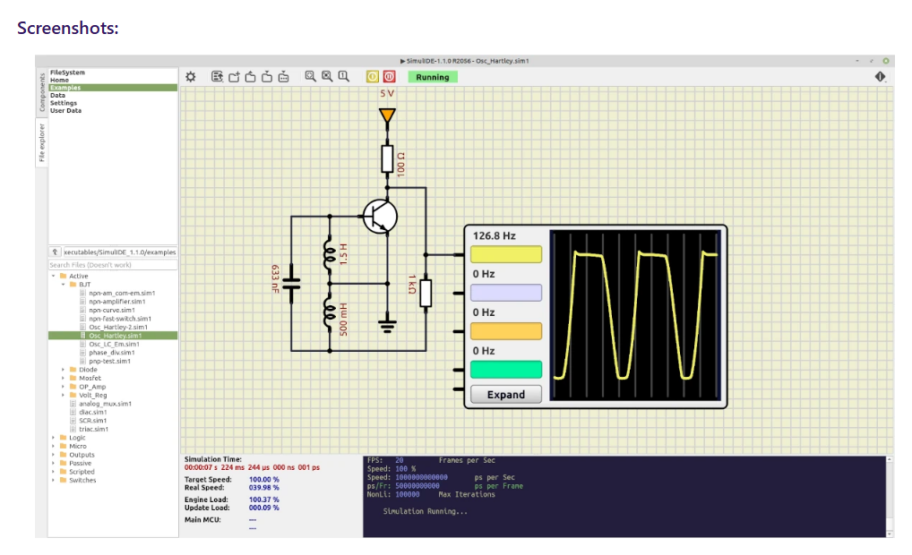

# 51 单片机学习项目

## 使用方式

直接在 VSCode/Trae IDE 中以**文件夹**方式打开 `d:\project\51-scm` 根目录即可：

- **构建工具**：PlatformIO + SDCC（`platformio.ini`）
- **代码补全/跳转**：clangd（PlatformIO 编译后自动生成 `compile_commands.json`）
- **烧录**：`pio run --target upload`（通过 `stcgal` 自动烧录）
- `docs/` 下的学习资料、笔记在同一个资源管理器里方便查阅
- `.trae/` 为 IDE 内部目录，不影响使用

### 构建命令

| 操作 | 命令 |
|---|---|
| 编译 | `pio run` |
| 烧录 | `pio run --target upload` |
| 串口监视器 | `pio device monitor` |
| 清理 | `pio run --target clean` |

### 新增子工程

在 `projects/` 下新建目录（如 `02-Button-Input`），放入 `platformio.ini`（定义 `[env:02-button]`）即可，PlatformIO 自动识别。

每个子项目的环境名建议与目录名关联，如：
- `projects/01-LED-Blink/` -> `[env:01-led]`
- `projects/02-Button-Input/` -> `[env:02-button]`

构建时进入对应子目录执行：
```bash
cd projects/01-LED-Blink && pio run
```

## 项目概述

本项目是一个系统性的 51 单片机学习资源库，包含多个实践项目和详细的学习资料，帮助学习者从入门到精通 51 单片机开发。

## 目录结构

```
51-scm/
├── projects/          # 实践项目目录
│   └── 01-LED-Blink/  # LED 闪烁（首个项目）
├── docs/              # 学习资料目录
│   ├── basics/        # 基础知识
│   ├── notes/         # 学习笔记
│   └── tools/         # 工具使用
├── .trae/             # IDE 内部目录（勿删）
└── README.md
```

## 学习路线

### 第一阶段：入门基础

1. 学习单片机基本概念和原理
2. 了解 STC89C52RC 单片机的硬件结构
3. 掌握 PlatformIO + SDCC 开发环境
4. 完成 LED 闪烁项目

### 第二阶段：外设模块

1. 学习 GPIO 端口操作
2. 掌握定时器/计数器的使用
3. 学习串口通信
4. 了解中断系统

### 第三阶段：通信协议

1. 学习 I2C 总线协议
2. 掌握 SPI 总线协议
3. 了解 UART 串口协议
4. 学习单总线协议

### 第四阶段：综合应用

1. 综合项目实践
2. 嵌入式系统设计
3. 项目调试与优化

## 开发环境

- **编译器**: SDCC（PlatformIO 内置，通过 `intel_mcs51` 平台自动安装）
- **构建系统**: PlatformIO Core (CLI) 或 PlatformIO VSCode 插件
- **烧录工具**: stcgal（PlatformIO 内置）
- **代码补全**: clangd（PlatformIO 编译后自动生成 `compile_commands.json`）
- **硬件平台**: STC89C52RC 开发板

## VSCode 开发环境配置

### 1. 安装 VSCode 扩展

在 VSCode 扩展市场安装以下插件：

| 扩展 | 作用 |
|---|---|
| **PlatformIO IDE** (`platformio.platformio-ide`) | 项目管理、构建、烧录 |
| **clangd** (`llvm-vs-code-extensions.vscode-clangd`) | 代码补全、跳转、错误检查 |
| **C/C++** (`ms-vscode.cpptools`) | clangd 依赖 |

### 2. 安装 PlatformIO CLI（可选）

VSCode 扩展会自带 CLI，也可独立安装：

```powershell
pip install platformio
```

### 3. 打开项目

```
文件 -> 打开文件夹 -> 选择 d:\project\51-scm
```

### 4. 首次构建（生成 compile_commands.json）

```bash
# 在 VSCode 终端中执行
pio run
```

PlatformIO 会自动安装 SDCC 工具链，首次构建耗时约 1~2 分钟。构建完成后 `compile_commands.json` 会出现在项目根目录，clangd 自动读取。

### 5. clangd 配置说明

项目根目录的 `.clangd` 文件已配置好（由本项目维护），内容说明：

```yaml
CompileFlags:
  CompilationDatabase: .    # 指向根目录的 compile_commands.json
  Add:
    - "-std=c99"            # C99 标准（SDCC 兼容）
    - "-target" "mcs51"     # 8051 架构（clangd 语法检查用，无实际编译作用）
  Remove:
    - "-Og" "-g2"           # 移除 SDCC 不识别的 GCC debug 选项
    - "-DHEAP_SIZE=*"       # 移除 PlatformIO 特有宏，减少 clangd 干扰
```

> 注意：clangd 只做语法/语义分析，不做实际编译。代码补全和跳转正常工作，但寄存器 SFR（如 `P1`、`TMOD`）仍会报 `unknown type name`，这是 clangd 不认识 8051 SFR 定义的正常现象，不影响编译。

### 6. 烧录到开发板

```bash
pio run --target upload
```

`stcgal` 会自动检测串口，提示"给开发板上电"时断电再通电即可完成烧录。

### 7. 常见问题

| 问题 | 解决方法 |
|---|---|
| clangd 报红（SFR 未定义） | 正常，clangd 不认识 8051 SFR，不影响编译 |
| `pio: command not found` | 重启 VSCode，或用完整路径 `~/.platformio/penv/Scripts/pio.exe` |
| 首次构建很慢 | 正常，PlatformIO 需要下载 SDCC 工具链（约 50MB） |
| clangd 补全不生效 | 确认已安装 clangd 扩展，执行 `Ctrl+Shift+P` -> `clangd: Restart Language Server` |

## 项目列表

| 序号 | 项目名称 | 难度 | 简介 |
| :--- | :--- | :--- | :--- |
| 01 | LED-Blink | 入门 | LED 闪烁控制 |
| 02 | Button-Input | 入门 | 按键输入检测 |
| 03 | Timer-Interrupt | 基础 | 定时器中断应用 |
| 04 | Serial-Comm | 基础 | 串口通信 |
| 05 | LCD1602 | 进阶 | LCD1602 显示 |
| 06 | I2C-EEPROM | 进阶 | I2C 总线与 EEPROM |
| 07 | SPI-LCD | 进阶 | SPI 总线与 LCD |
| 08 | DS18B20 | 进阶 | 单总线温度传感器 |
| 09 | ADC-Potentiometer | 进阶 | ADC 模数转换 |
| 10 | Motor-Control | 高级 | 电机控制 |

## 学习资料说明

### docs/basics/
- 单片机基础知识
- C51 语言编程
- 寄存器操作

### docs/notes/
- 学习笔记模板

### docs/tools/
- VSCode / PlatformIO 开发环境配置教程
- 调试技巧

## 注意事项

1. 开发板供电电压为 5V，请勿接反电源
2. 烧录程序时请先断开电源，再连接串口线
3. 下载程序后请重新上电复位
4. 涉及硬件操作时，请确认电路连接正确


# 仿真
[SimuIIde](https://simulide.com/p/)
