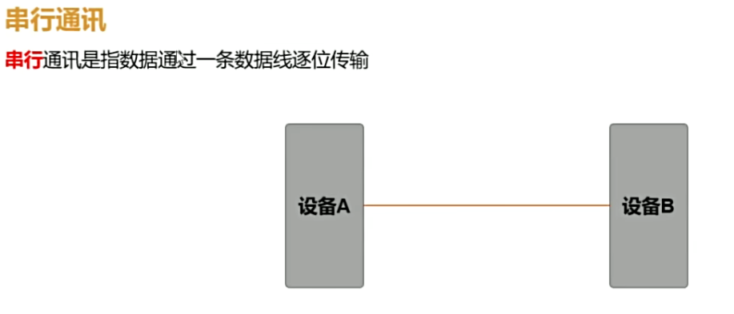
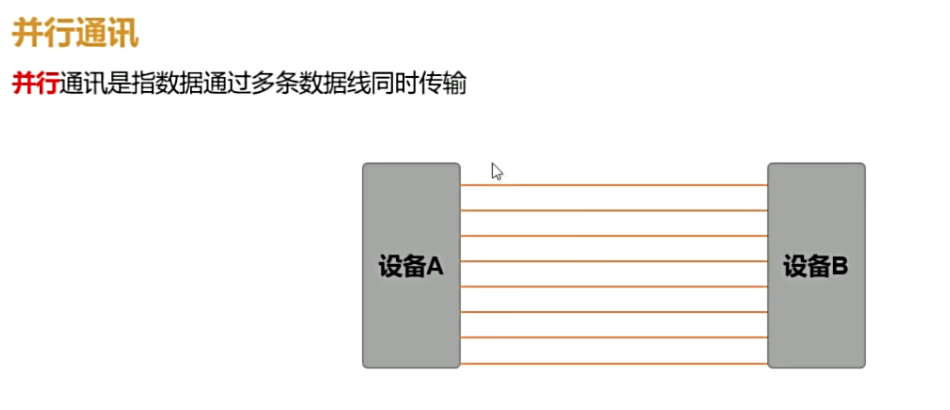

# 通信基础

## 串行 vs 并行

- **串行通信**:数据通过一条数据线逐位传输
- **并行通信**:数据通过多条数据线同时传输





| 对比项 | 串行 | 并行 |
|--------|------|------|
| 传输速率 | 低 | 高 |
| 硬件成本 | 高 | 低 |
| 抗干扰能力 | 低 | 高 |
| 通讯距离 | 近距离 | 远距离 |

## 通信方向

- **单工**:只能单向传输(广播)
- **半双工**:双向,但同一时刻只能单向(对讲机)
- **全双工**:双向同时传输(电话)

## 同步 vs 异步

- **同步通信**:收发双方共用时钟线,数据连续传输,效率高(SPI、I²C)
- **异步通信**:收发双方各自用独立时钟,依靠约定好的波特率逐帧传输(UART)

## 异步通信数据帧

```
 起始位   数据位(5~8)   校验位(可选)   停止位(1~2)
   |  D0  D1  ...  D7  |   P    |  S |
```

- **起始位**:1 位低电平,标志帧开始
- **数据位**:通常 8 位,低位先行
- **校验位**:可选的奇偶校验
- **停止位**:1~2 位高电平,标志帧结束