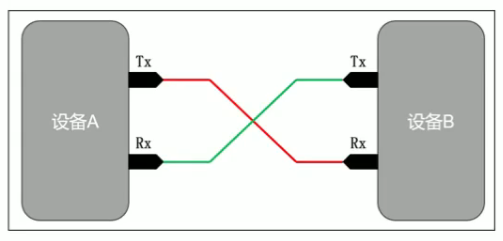
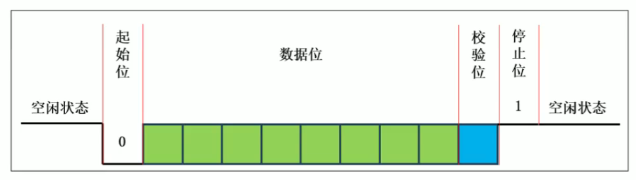
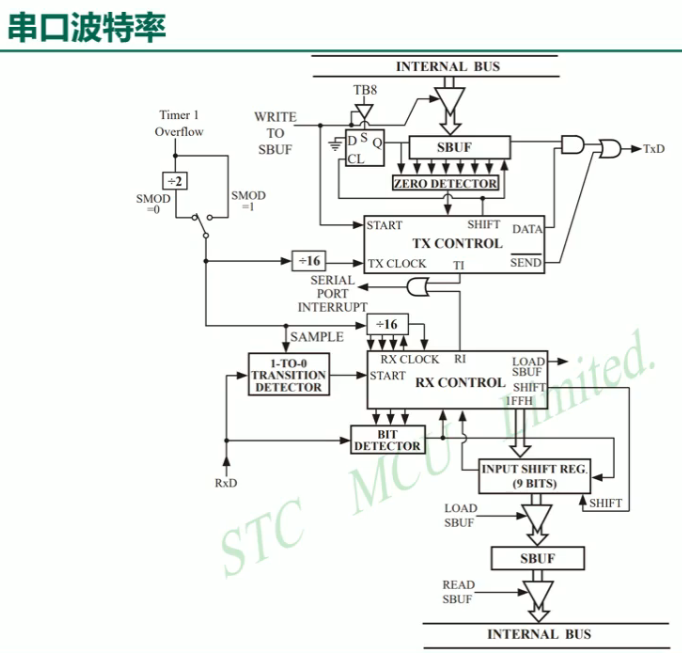

# UART通信协议

Universal Asynchronous Receiver/Transmitter
UART通信协议是一种串行通信协议, 它定义了数据在串行通信中的传输格式和时序。

- 异步
- 全双工
- 串行

常用与单片机之间的通信和与其他设备之间的通信, 如 PC机、手机等。



## 数据格式

数据是逐帧传输的, 每一帧包含起始位、数据位、校验位和停止位。



### 起始位

起始位是 1 位低电平, 标志帧开始。

### 数据位

数据位是 5~8 位, 低位先行。

### 校验位

校验位, 可选的奇偶校验。

- 奇校验: 数据位中 1 的个数为奇数
- 偶校验: 数据位中 1 的个数为偶数

### 停止位

停止位, 1~2 位高电平, 标志帧结束。


## 约定

### 波特率

波特率, 每秒传输的位数。
作用: 定义了数据在串行通信中的传输速率。

### 数据位

明确数据位的数量, 5~8 位。

### 校验位

校验位, 可选的奇偶校验。
作用: 检测数据传输过程中是否发生了错误。
- 奇校验: 数据位中 1 的个数为奇数
- 偶校验: 数据位中 1 的个数为偶数

### 停止位

停止位, 1~2 位高电平, 标志帧结束。
-作用: 标志帧结束, 用于同步接收数据。


# STC89C52 的 UART 通信协议

- 全双工
- 串行

## 引脚
- TXD: 发送数据引脚
- RXD: 接收数据引脚

## 模式
| 方式 | 模式 | 作用 |
|--------|------|------|
| 模式0 | 同步位移串行方式 | 位移串行方式 | 位寄存器 |
| 模式1 | 8位UART |  波特率可调, 无校验位 |
| 模式2 | 9位UART, 波特率不可调 |  波特率不可调, 有校验位 |
| 模式3 | 9位UART |  波特率可调, 无校验位 |

# 使用

## SCON 寄存器

SCON 寄存器, 用于设置 UART 工作模式。

| SFR name | addrss | bit | B7 | B6 | B5 | B4 | B3 | B2 | B1 | B0 |
|--------|------|------|------|------|------|------|------|------|------|------|
| SCON | 98H | name | SM0/FE | SM1 | SM2 | SM3 | SM4 | SM5 | SM6 | SM7 |

SM0 与 SM1 用于选择工作模式。

| SM0 | SM1 | 作用 |
|--------|------|------|
| 0 | 0 | 同步位移串行方式 |
| 0 | 1 | 8位UART |
| 1 | 0 | 9位UART, 波特率不可调 |
| 1 | 1 | 9位UART |

## 波特率

设置波特率。

Timer1 Overflow 用于设置波特率。
只要定时器1 溢出, 就会触发 SMOD -> 分频器 -> 控制发送;

怎么控制波特率？
控制 Timer1 分频器, 即可控制波特率。
控制 SMOD 寄存器, 即可控制波特率。



## PCON 寄存器

PCON: 电源控制寄存器(不可寻位)

| SFR name | addrss | bit | B7 | B6 | B5 | B4 | B3 | B2 | B1 | B0 |
|--------|------|------|------|------|------|------|------|------|------|------|
| PCON | 97H | name | SMOD | SMOD0 | -- | POF | GF1 | GF0 | PD | IDL |

直接设置 PCON 寄存器, 即可控制 UART 电源。

SMOD = 0, 表示SMOD不分离控制频率( 波特率 )

### 定时器1控制

51 单片机的 UART 波特率由定时器 1 的溢出率决定, 模式 1 下(8 位 UART, SMOD=0):

波特率 = SysClock / 32 / 12 / (256 - TH1)

反推 TH1:
TH1 = 256 - SysClock / 32 / 12 / 波特率

#### 目标: 9600 波特率, 晶振 11.0592 MHz

TH1 = 256 - 11059200 / 32 / 12 / 9600
    = 256 - 3
    = 253 = 0xFD

#### TMOD 寄存器位说明

定时器 1 工作在模式 2(8 位自动重装载), TMOD 高 4 位:

| 位   | 名称 | 取值 | 说明 |
|------|------|------|------|
| M1   | 0x20 bit5 | 1   | 模式 2: 8 位自动重装载 |
| M0   | 0x20 bit4 | 0   | — |
| C/T  | 0x20 bit6 | 0   | 0 = 定时器(对内部机器周期计数); 1 = 计数器(对外部 T1 引脚计数) |
| GATE | 0x20 bit7 | 0   | 0 = 软件 TR1 直接启动; 1 = 受外部 INT1 引脚控制 |

#### 示例配置代码

```c
// 目标: 9600 波特率, 晶振 11.0592 MHz, SMOD = 0
TMOD &= 0x0F;        // 清除定时器1 原有设置, 保留定时器0
TMOD |= 0x20;        // M1=1 M0=0 C/T=0 GATE=0 → 定时器1 模式2
TH1 = 0xFD;          // 初值 253, 自动重装载
TL1 = 0xFD;
TR1 = 1;             // 启动定时器1, 产生波特率时钟
```

> 注意: SMOD 控制的是分频系数, 取 0 时波特率公式中分母为 32, 取 1 时为 16(波特率翻倍)。

# 发送数据

- **TI**: 发送完成中断标志位, 需软件清零
- **SBUF**: 发送 / 接收共用, 地址均为 `0x99`, 写入即启动发送

发送流程: CPU 写 `SBUF` → 硬件按帧发出 → 完成后置 `TI=1` → 软件清 `TI`

# 接收数据

默认不开启接收, 必须设置 `REN=1`(`SCON` 寄存器 B4 位)才能接收。

- **REN**: 接收使能位, `SCON.4`
- **RI**: 接收完成中断标志位, 需软件清零

接收流程: `REN=1` → 硬件按位采样 → 一帧结束后存入 `SBUF` → 置 `RI=1` → 软件读 SBUF 并清 `RI`

# 串口中断

发送 (TI) 和接收 (RI) 共用同一个中断向量(入口地址 `0023H`), 进入中断后需查询标志位判断来源, 并软件清零。

# 代码示例

```c
// 接收数据中断处理函数
void UART_Interrupt(void) interrupt 4{
    if (TI == 1)
    {
        // 处理发送完成中断
        // ...
        // 清 TI, 需要软件处理, 因为硬件不知道是否处理完成
        TI = 0;
    }
    if (RI == 1)
    {
        // 读取接收数据
        uint8_t data = SBUF;
        // 处理数据
        // ...
        // 清 RI, 需要软件处理, 因为硬件不知道是否处理完成
        RI = 0;
    }
}
```

